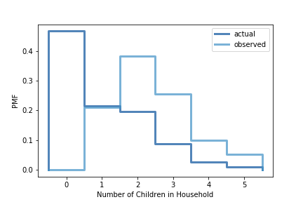

[Think Stats Chapter 3 Exercise 1](http://greenteapress.com/thinkstats2/html/thinkstats2004.html#toc31) (actual vs. biased)

**Exercise:** Something like the class size paradox appears if you survey children and ask how many children are in their family. Families with many children are more likely to appear in your sample, a$

Use the NSFG respondent variable `numkdhh` to construct the actual distribution for the number of children under 18 in the respondents' households.

Now compute the biased distribution we would see if we surveyed the children and asked them how many children under 18 (including themselves) are in their household.

Plot the actual and biased distributions, and compute their means.

*Loading the relevant data:*

    resp = nsfg.ReadFemResp()

*Computing the actual PMF:*

    pmf = thinkstats2.Pmf(resp.numkdhh,label='actual' )

*Defining the biased PMF as perceived by the children themselves:*

    def BiasPmf(pmf, label):
        new_pmf = pmf.Copy(label=label)
        for x, p in pmf.Items():
            new_pmf.Mult(x,x)
        new_pmf.Normalize()
        return new_pmf

*Plotting the biased versus actual PMF:*

    biased_pmf = BiasPmf(pmf,label='observed')
    thinkplot.PrePlot(2)
    thinkplot.Pmfs([pmf, biased_pmf])
    thinkplot.Config(xlabel = 'Number of Children in Household', ylabel='PMF')

*Actual versus observed PMF means:*

    print('Actual mean', pmf.Mean())
    print('Observed mean', biased_pmf.Mean())

    Actual mean 1.024205155043831
    Observed mean 2.403679100664282

