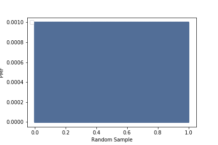
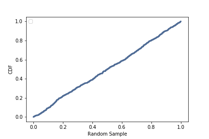

[Think Stats Chapter 4 Exercise 2](http://greenteapress.com/thinkstats2/html/thinkstats2005.html#toc41) (a random distribution)

**Exercise:** The numbers generated by numpy.random.random are supposed to be uniform between 0 and 1; that is, every value in the range should have the same probability.

Generate 1000 numbers from numpy.random.random and plot their PMF. What goes wrong?

Now plot the CDF. Is the distribution uniform?

*Setting up the random sample generated from numpy.random.random:*

    import matplotlib.pyplot as plt
    sample = np.random.random(1000)

*Creating and plotting the PMF:*

    sample_pmf=thinkstats2.Pmf(sample, label=None)

    thinkplot.Pmf(sample_pmf)
    thinkplot.Config(xlabel='Random Sample', ylabel='PMF')

*It seems that the plot is full of solid lines because each number has exact same probability, which is exactly what was supposed to happen based on how we selected the sample.*

*Creating and plotting the CMF:*

    sample_cdf=thinkstats2.Cdf(sample, label=None)

    thinkplot.Cdf(sample_cdf)
    thinkplot.Config(xlabel='Random Sample', ylabel='CDF')

*As expected, the CMF is close to a straight line as the cumulative probability is increasing in a uniform fashion. It is, in fact, uniform.*
