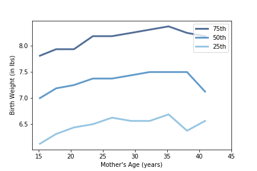

[Think Stats Chapter 7 Exercise 1](http://greenteapress.com/thinkstats2/html/thinkstats2008.html#toc70) (weight vs. age)

Using data from the NSFG, make a scatter plot of birth weight versus mother’s age. Plot percentiles of birth weight versus mother’s age. Compute Pearson’s and Spearman’s correlations. How would you characterize the relationship between these variables?

*First, we import our data:*

    import first

    live, firsts, others = first.MakeFrames()
    live = live.dropna(subset=['agepreg', 'totalwgt_lb'])

*Then, make the scatter plot of birth weight versus mother's age:*

    birth_weight, mother_age = live.totalwgt_lb, live.agepreg
    thinkplot.Scatter(mother_age, birth_weight, alpha=0.5, s=10)
    thinkplot.Config(xlabel='Mother Age',
                     ylabel='Birth Weight (in lbs.)',
                     axis=[10, 45, 0, 16],
                     legend=False)

*Then, prepare the bins and plot the percentiles of weight versus mother's age:*

    bins = np.arange(10, 48, 3)
    indices=np.digitize(live.agepreg, bins)
    groups = live.groupby(indices)

    mean_ages = [group.agepreg.mean() for i, group in groups][1:-1]
    cdfs = [thinkstats2.Cdf(group.totalwgt_lb) for i, group in groups][1:-1]

    thinkplot.PrePlot(3)
    for percent in [75, 50, 25]:
        weight_percentiles = [cdf.Percentile(percent) for cdf in cdfs]
        label = '%dth' % percent
        thinkplot.Plot(mean_ages, weight_percentiles, label=label)
    
    thinkplot.Config(xlabel="Mother's Age (years)",
                     ylabel='Birth Weight (in lbs)',
                     xlim = [14,45],
                     legend=True)

*Then calculate Pearson's and Spearman's Correlations:*

    print("Pearson's Correlation: ", Corr(mother_age, birth_weight))
    print("Spearman's Correlation: ", SpearmanCorr(mother_age, birth_weight))

    Pearson's Correlation:  0.06883397035410908
    Spearman's Correlation:  0.09461004109658226

*It appears that the correlation between these two variables is very weak. It would also appear that the relationship is non-linear.*
