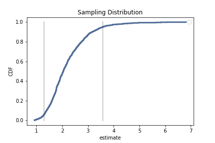

[Think Stats Chapter 8 Exercise 2](http://greenteapress.com/thinkstats2/html/thinkstats2009.html#toc77)

**Exercise:** Suppose you draw a sample with size n=10 from an exponential distribution with λ=2. Simulate this experiment 1000 times and plot the sampling distribution of the estimate L. Compute the standard error of the estimate and the 90% confidence interval.

Repeat the experiment with a few different values of n and make a plot of standard error versus n.

*Creating a sample from an exponential distribution:*

    import matplotlib.pyplot as plt
    def SimulateSample(lam=2, n=10, iter=1000):
    
*Making lines for the confidence interval:*

        def VertLine(x, y=1):
            thinkplot.Plot([x,x],[0,y], color='0.8', linewidth = 3)

*Assembling estimates:*
        
        estimates=[]
        for _ in range(iter):
            xs=np.random.exponential(1.0/lam, n)
            lamhat = 1.0/np.mean(xs)
            estimates.append(lamhat)

*Figuring out standard error:*
            
        stderr = RMSE(estimates, lam)
        print('standard error: ', stderr)

*Plotting CMF:*
        
        cdf = thinkstats2.Cdf(estimates)
        ci = cdf.Percentile(5), cdf.Percentile(95)
        print('confidence interval: ', ci)
        VertLine(ci[0])
        VertLine(ci[1])
        
        thinkplot.Cdf(cdf)
        thinkplot.Config(xlabel = 'estimate', ylabel = 'CDF', title = 'Sampling Distribution')
           
        return stderr

*Running the function:*

    SimulateSample()

    standard error:  0.7908742003078584
    confidence interval:  (1.2733780244522475, 3.5708967384824803)

*If n is increased, all confidence intervals still contain the actual value of λ, 2.*
