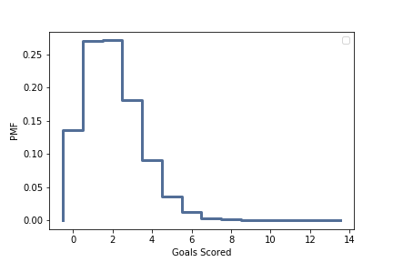

[Think Stats Chapter 8 Exercise 3](http://greenteapress.com/thinkstats2/html/thinkstats2009.html#toc77)

**Exercise:** In games like hockey and soccer, the time between goals is roughly exponential. So you could estimate a team’s goal-scoring rate by observing the number of goals they score in a game. This estimation process is a little different from sampling the time between goals, so let’s see how it works.

Write a function that takes a goal-scoring rate, lam, in goals per game, and simulates a game by generating the time between goals until the total time exceeds 1 game, then returns the number of goals scored.

Write another function that simulates many games, stores the estimates of lam, then computes their mean error and RMSE.

Is this way of making an estimate biased?

*Provided the function that simulates a game and returns the estimated goal-scoring rate:*

*lam - actual goal scoring rate in goals per game*

    def SimulateGame(lam):

        goals = 0
        t = 0
        while True:
            time_between_goals = random.expovariate(lam)
            t += time_between_goals
            if t > 1:
                break
            goals += 1

        L = goals
        return L

*Writing the function that simulates many games and computes the mean error and RMSE of many lam estimates:*

    import matplotlib.pyplot as plt
    def Estimate12(lam=2, m=10000000):
    
        estimates=[]
        for i in range(m):
            L = SimulateGame(lam)
            estimates.append(L)
       
        print('Scoring Experiment')
        print('RMSE L: ', RMSE(estimates, lam))
        print('Mean Error L: ', MeanError(estimates, lam))
    
        pmf = thinkstats2.Pmf(estimates)
        thinkplot.Pmf(pmf)
        thinkplot.Config(xlabel = 'Goals Scored', ylabel = 'PMF')

    Estimate12()

    Scoring Experiment
    RMSE L:  1.4140512366954743
    Mean Error L:  0.0003173

*The RMSE = 1.41, and the mean error is rather small, so it doesn't seem to be biased.*
